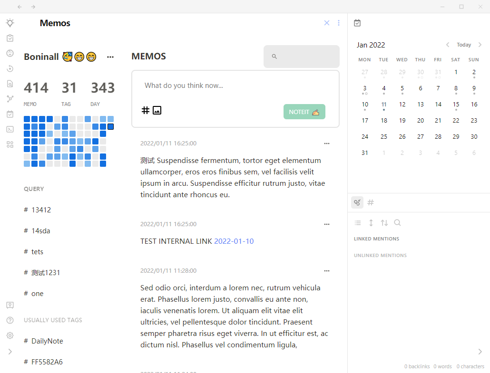
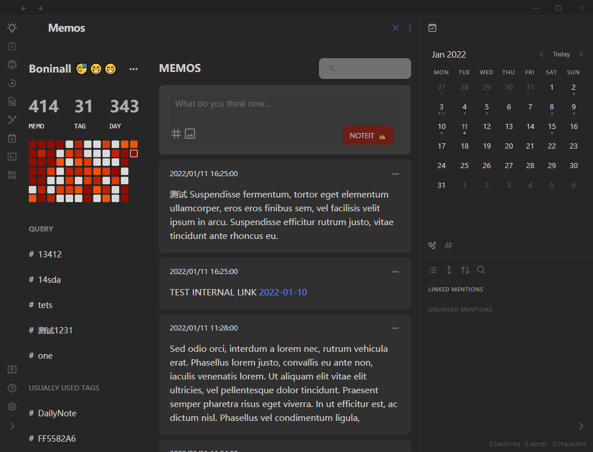
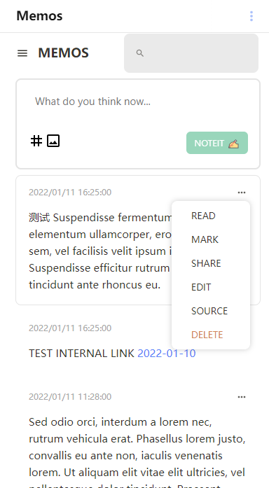

# Obsidian Memos

[中文文档](./document/chinese.md)

A new way for you to quick capture idea in Obsidian. Which is highly based on awesome open project: [memos](https://github.com/justmemos/memos)and awesome service: [flomo](https://flomoapp.com/).

## Introduce

1. All the memos comes from your daily notes, so you should open Daily Notes Plugin to make the plugin works.
2. And all memos are comes from a header you set( like `# Journal` ) in daily notes.
3. When you create a query, a query.md file will be generated automatically in your daily note folder.
4. When you delete a memo, it will send to the delete.md in your daily note folder, please don't edit it directly.

## How to Use

1. First you should have daily notes plugin (the core plugin of Obsidian) opened
2. Then, you should check the setting to set your header if you have some header in you daily note, OR leave blank to make the journal wrote to your the end of your daily note.
3. Open memos and then noteit.

Now memos find all the mark as follow in your daily notes.

Allow:

- `- 19:00` in daily note.
- `- [ ] 19:00` in daily note.

## Features

### Tag list

Build in tag list for JUST memos. The build in tag list will show the tags in your memos.

### Query

You can set a query that contains more than one variable to query memos. You can add it\pin it\Delete it

### Heatmap

You have a github heatmap like view to see your memos everyday, like dots in calendar. But all of them is clickable to filter that day's memos.

### Clickable day

You can click on the day and then see all your memos today, yesterday, and so on(it based on `day` not week or month)

### User banner

You can set your name in setting ,so don't forget to do it. And you can find the setting and trash box for memos when you click on the three dots near the user name.

### Editor

You can edit a memo and then click on NOTEIT button to add memo. Of course you can drag and drop images into the editor, which will put the images into your vault.(Will add the option to upload soon)

And after the ver 1.1.0, you have tag suggester to improve your life.

### Memo list

You can see all your memos here, just scroll down to see every day and so on.

In each memo, you can used MARK to make it link to another memo. And you can delete it, share it and so on.

What's more, 

1. you can double click on the memo to edit the memo.
2. Ctrl+click to jump to the source of the memo.

Of course, internal link or image link in memo should be renderred as usual.

### Search and filter

Every time, you search in memos will filter the memos that matched (which are showed in one page), and in memos, there are already four build-in filters to help you for using memos easily. 

## Problems NOW

- [ ] Share Image seems have some bugs.

## Install

### Plugin Market

Not yet

### BRAT

Add `Quorafind/Obsidian-Memos` to BRAT.

### Manual Install

Download the latest release. Extract and put the three files (main.js, manifest.json, styles.css) to folder `{{obsidian_vault}}/.obsidian/plugins/Obsidian-Memos`.

# Say Thank You

If you are enjoying Big Calendar then please support my work and enthusiasm by buying me a coffee on [https://www.buymeacoffee.com/boninall](https://www.buymeacoffee.com/boninall).

